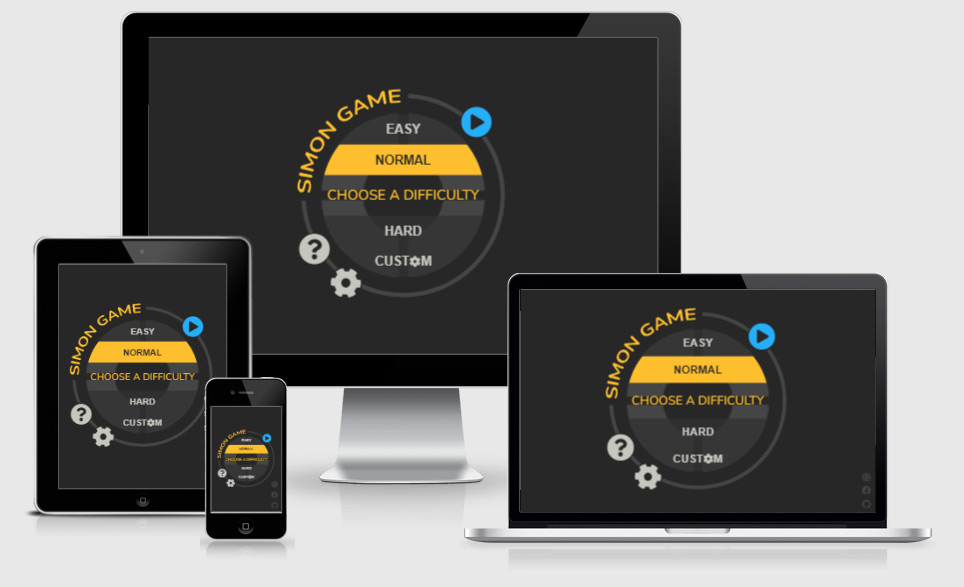
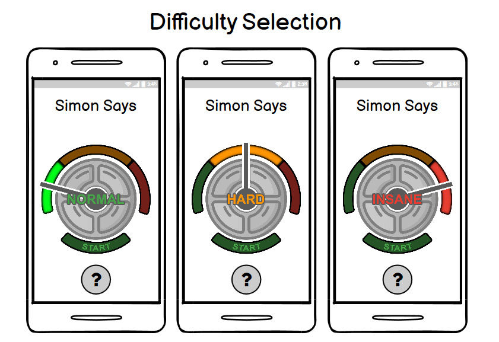
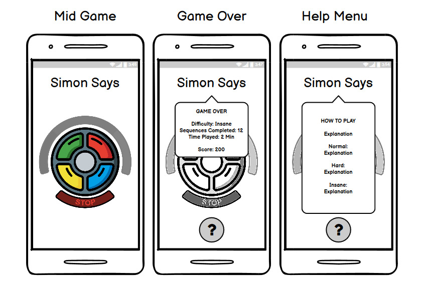
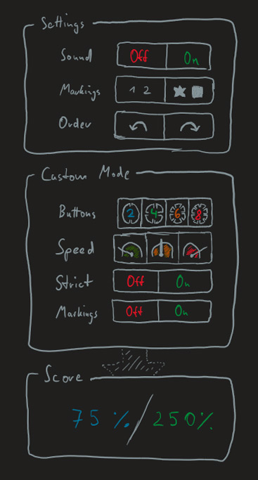
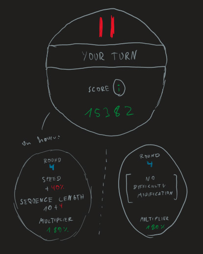
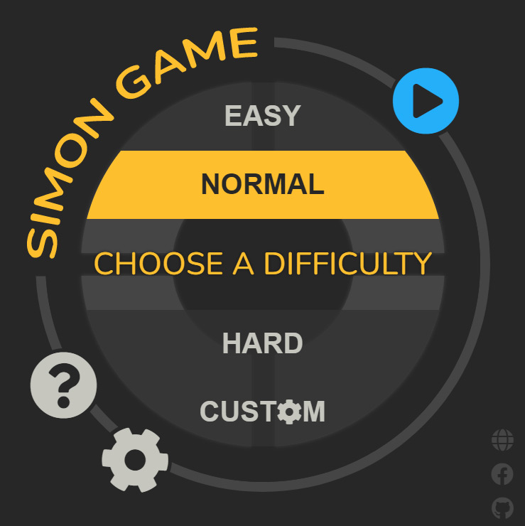
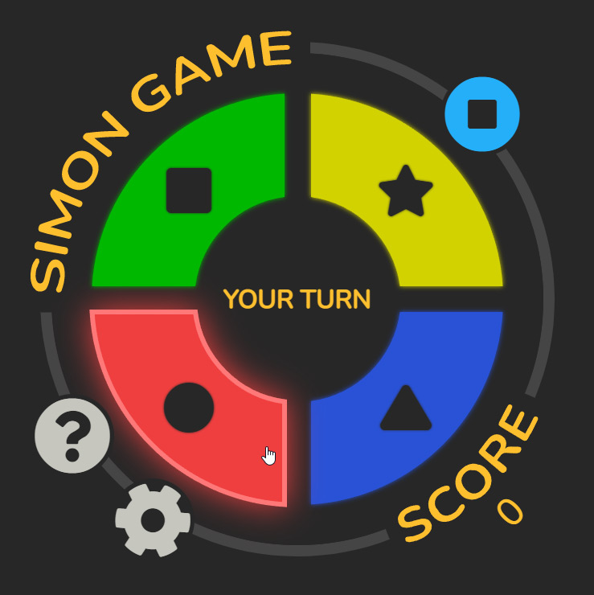
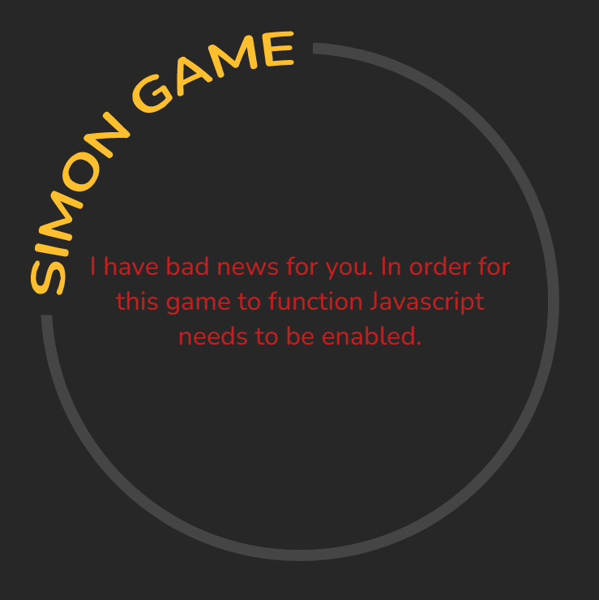

# **Milestone Project 2 - Simon Game**
## Javascript Game - <a href="https://chrotesque.github.io/ci-portfolio-project-2/" target="_blank">View deployed site here.</a>

 

 

# Table of Contents

1. [Overview](#overview-)
2. [UX](#ux-)
3. [Features](#features-)
4. [Technologies Used](#technologies-used-)
5. [Validation and Testing](#validation-and-testing-)
6. [Bugs](#bugs-)
7. [Deployment](#deployment-)
8. [Credits](#credits-)
9. [Statistics](#statistics-)
10. [Acknowledgements](#acknowledgements-)

 

# **Overview** ([^](#table-of-contents))

Simon Game is a simple game about memorizing and replicating a sequence of button presses by the computer. The project consists of a single page with all necessary elements already in place, dynamic information is then being placed by Javascript which also runs the games logic.  

# **UX** ([^](#table-of-contents))

* ## **Strategy**

    This project was made specifically for the Full Stack Development course by Code Institute as 2nd milestone project. 
    This particular game was chosen as basis for the work as it seemed the most complex of the ideas I prepared for the first Mentor meeting, my Mentor also remarked that he hadn't seen this particular game done previously by others. 

    ### **User Stories**
    As a first time user ...
    1. I want to be able to understand what the game is about and how it is played.
    2. I don't want to spend much time on setting the game up but rather jump right into it.

     

    As a returning user ...
    1. I want to be able to change up my experience through different difficulty settings. 
    2. I also want to be able to further increase the difficulty later down the line or change the game to my specific needs. 

     

* ## **Scope**

    The project offers:
    - the base game experience that most people are experienced with
    - a help menu to explain all necessary details of the game including the modifications / options I provided
    - a settings menu to customize the experience
    - an arbitrary score amount chosen me attached to various successful actions within the game and displayed to the user
    - a very compact design

     

* ## **Structure**

    The structure of the project is relatively simple and divided into:
    - a game area where user interactions occur
    - menus in which text is either simply being displayed or more user interaction is possible
    - a small social link collection of the developer

     

* ## **Skeleton**

    The project offers 3 paths to take portrayed by 3 distinct and commonly understood buttons:
    - a start icon to start the game, changing to a stop icon to stop the game manually
    - a gear icon to open the settings menu
    - a question mark icon to open the help menu

        
    
    The game offers clear and unambigious information about the state of the game in the middle of the screen as to what's going on or what just happened, ie: "Game Over", "Game Stopped", "Your Turn", etc. 

    ### **Wireframes**
    

    
Mobile Only Wireframes: Difficulty Selection, Mid Game / Game Over & Help Screen

    
    
    

    - Note: I believed the game was called Simon Says. I later learned it's generally known as Simon Game instead.

    

    
Hand-made Sketches from MS OneNote: Settings Menu & Middle Display

    
    
    

    - Due to size contraints I later opted out of the middle display of ingame information such as the exact speed percentage currently in effect, etc.
    
     

* ## **Surface**

    I employed a desktop first approach which later turned out to be a mistake, one I found rather hard to remedy. As such the game went through a variety of styles. While I developed a portion of the Javascript without a real GUI, I later invested a great deal of time towards a main feature of the game, offering multiple button configurations (3, 4, 5 or 6).

    The iteration I stuck with uses SVGs for unlimited scaling in theory to also avoid artifacts when using .jpg/.png image files or similar formats and additionally to improve performance on mobile, to avoid the download of big files which would undoubtably be required to make the game look good at bigger resolutions.
    
    The game in it's latest iteration is rather compact and all required elements are gathered around the center of the screen. The name and the score (not visible at first) are part of the surrounding frame: 

    

    This is the game during gameplay, now with score visible:

    

    This is what remains with Javascript turned off:

    

    The menus were initially designed to be speech bubbles (as a direct hint towards the name of the game "Simon Says", that idea was then dropped when I realized the actual name of the game) and ended up in more of a pop up design with an easy to understand close icon in the top right:

    

    ## Color scheme & Font choice

    I based this project on a recommendation listed in <a href="https://www.pagecloud.com/blog/best-google-fonts-pairings" target="_blank">this article</a> but made modifications along the way. 
    Nunito is the only font used in the entire project.

    ## Graphics

    Instead of rasterized images I created vector graphics and use them as svgs within the html which were created using [Adobe Photoshop](#technologies-used-).

# **Features** ([^](#table-of-contents))

## Responsive

The page scales down to roughly 270px width and technically the same amount of height. Technically only because a real smartphone does include various interface elements that further reduce the height of the available screen. Realistically it scales down to about 340px height.

 

## Interactivity

### General
The project provides feedback in varies ways:
- the most important button start/stop of the game is being displayed in a unique color when compared to the rest of the UI
- hover effects for desktop users
- buttons / elements that are "active" are highlighted in the main color orange of the project
- active buttons in the settings menu have a thicker outline due to borders to highlight what's considered on and what is considered off, based off of user experience feedback
- all warning messages on the project are displayed in red
- the settings menu is divided into 2 portions:
    1. Game Settings: controls sound and markings options
    2. Custom Difficulty: upon changing a setting here, the custom difficulty will immediately be selected according to the settings visible there
- custom difficulty settings get deactivated once a game is running in either difficulty, mostly to avoid confusion and as an easy way to handle certain code dificiencies - without that feature, it would be easily possible to break the game and while it's possible to remedy this, it would require further work that has very little benefit
- in order to inform the user of the score multiplier, the custom difficulty section displays the percentage which dynamically changes when settings are changed
- the help menu features values directly gathered from the global settings variable in the Javascript file, thus not requiring a change of the html in case values are changed within the Javascript code

 

### Settings

The game offers 3 hard set difficulty modes and a custom difficulty, which can be adjusted to the users preferences.
It features these options:
- Buttons - the amount of buttons being used to play the game
- Speed - the speed of the computer playing the buttons
- Strict Mode - allows the user to make mistakes and still continue to play the game, the computer will simply repeat the last turn instead
- Ramp Up - allows the user a greater challenge as the game goes on, ever increasing the difficulty by increasing the sequence length with each round as well as the computer speed

 

### The Game

When a game is running, feedback is provided as such:
- if the sound setting is set to on, the game will play sound effects
- the middle of the screen shows the ingame status ("Your Turn", "Computer Turn") as well as game status ("Game Over",  Choose Difficulty") informing the player as to what's going on

 

### Accessibility
- the settings offer accessibility options to make the game easier to play for those with color blindness, while not optimized for the various forms of color blindness they offer some variety of marking types to help and markings are on by default
- the help menu explains the game, how it works, the differences between the difficulty modes, point base values and a few settings that are not necessarily quick to understand on first glance
- the custom difficulty has its "O" replaced with the gear icon also being used for settings, based off of user experience feedback it wasn't immediately apparent that this difficulty requires a check of the settings menu and I felt this was an easy way to connect these two, in addition to changes of those settings automatically selecting the difficulty itself

 

## Cheating Prevention

The game is using a few global variables. Access to those through the console would make it rather easy to cheat. During my research I stumbled upon the use of a so-called "Scoping Function", meaning enveloping the entire code base in a function that is being called immediately. Therefore all global variables are within scope and inaccessible to the console.

 

## Error Handling

- No direct user input is required, instead the user interacts with the project through buttons in the settings menu and in the main screen
- As shown above in the section [Surface](#surface) the game shows a warning message should Javascript be deactivated, instructing the user what to do

 

# **Technologies Used** ([^](#table-of-contents))
- Main languages: <a href="https://en.wikipedia.org/wiki/HTML5" target="_blank">HTML5</a>, <a href="https://en.wikipedia.org/wiki/Cascading_Style_Sheets" target="_blank">CSS3</a> & <a href="https://en.wikipedia.org/wiki/JavaScript" target="_blank">Javascript</a>
- <a href="https://fonts.google.com/" target="_blank">Google Fonts</a> used for fonts throughout the whole site
- <a href="https://fontawesome.com/" target="_blank">Font Awesome</a> used for a few select icons to be able to style them as font/text
- <a href="https://git-scm.com/" target="_blank">Git</a> used for version control through the Gitpod terminal for deployment onto Github
- <a href="https://github.com/" target="_blank">GitHub</a> used as host and for deployment of the site
- <a href="http://gitpod.com" target="_blank">Gitpod</a> used as IDE
- <a href="https://validator.w3.org/" target="_blank">W3C Markup Validation Service</a> used to validate HTML code
- <a href="https://jigsaw.w3.org/css-validator/" target="_blank">W3c CSS Validation Service</a> used to validate CSS code
- <a href="https://jshint.com/" target="_blank">JSHint</a> used to analyze and error correct the Javascript code
- <a href="https://color.a11y.com/" target="_blank">a11y Color Contrast Accessibility Validator</a> used to validate contrast accessibility
- <a href="http://clickup.com" target="_blank">ClickUp</a> used for project management
- <a href="https://wakatime.com" target="_blank">WakaTime</a> used as time tracking tool
- <a href="https://www.adobe.com/products/photoshop.html" target="_blank">Adobe Photoshop 2021</a> used for the creation of vector graphics
- <a href="https://tinypng.com/" target="_blank">TinyPNG</a> used to optimize JPG and PNG file sizes for this readme
- <a href="https://lettercounter.github.io/" target="_blank">Lettercounter</a> used to keep commit messages below or at 50 characters
- <a href="http://ami.responsivedesign.is/" target="_blank">Am I Responsive?</a> used to create responsive preview of the site used at the top of this readme
- <a href="https://coolors.co/" target="_blank">Coolors</a> used to create a color palette for this project
- <a href="https://balsamiq.com/" target="_blank">Balsamiq</a> used to create the wireframes during the initial design stage

 

# **Validation and Testing** ([^](#table-of-contents))

TBD

# **Bugs** ([^](#table-of-contents))

TBD

# **Deployment** ([^](#table-of-contents))
This project was developed using Gitpod through which it was committed and pushed to the repository on Github as host:
1. Visit <a href="https://github.com/" target="_blank">GitHub</a> and login
2. Open the <a href="https://github.com/Chrotesque/ci-portfolio-project-1" target="_blank">respository</a>

## Github pages
Github pages were used to deploy the project as follows:
1. Open the **Settings** on the repository specific navigation marked with a gear icon
2. Navigate to the **Pages** subnavigation on the left
3. Select the master branch under **Source** and click **Save**
4. The page refreshes automatically and displays the published site URL at the top next to an exclamation mark
5. It will take a couple of minutes for the site to become available initially

## Making a Local Clone
Once the project has been accessed on Github:
1. Underneath the repository specific navigartion you'll find the button **Code** on the right side above the file listing
2. Upon click, the pop-up will offer the option to copy the repository's git-URL with HTTPS selected at the top within the pop-up
4. Open a Git Bash terminal
5. Change the current working directory to the location where you want the cloned directory to be made
6. Type **git clone**, and then paste the URL you copied in Step 3 and hit Enter; your local clone will now be created

 

# **Credits** ([^](#table-of-contents))
## Content & Media
- All content was written by the developer
- Vector graphics contained within the index.html were created by the developer
- The color palette was created by the developer himself, based off of <a href="https://www.pagecloud.com/blog/best-google-fonts-pairings" target="_blank">this article</a>
- The font Nunito is being provided by <a href="https://fonts.google.com/" target="_blank">Google Fonts</a>
- Icons from <a href="https://fontawesome.com/" target="_blank">Font Awesome</a>

## Code
- The sleep function used in my javascript file came from <a href="https://www.sitepoint.com/delay-sleep-pause-wait/" target="_blank">this article</a>

## Readme
- I copied various portions of my previously created <a href="https://github.com/Chrotesque/ci-portfolio-project-1/blob/main/README.md" target="_blank">my previously created README</a> for my milestone project 1
- I took inspiration from <a href="https://github.com/code-institute-solutions/samplereadme" target="_blank">the SampleReadme from Code Institute</a>.

 

# **Statistics** ([^](#table-of-contents))

According to Wakatime this project took me roughly 93 hours. This does not include research nor graphics creation.

# **Acknowledgements** ([^](#table-of-contents))
I'd like to thank:
- My Mentor Jack Wachira for our concise and very helpful feedback sessions
- My girlfriend Joyce for providing helpful user experience feedback