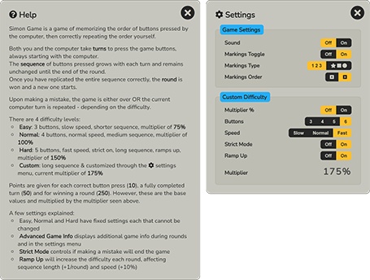

# **Milestone Project 2 - Simon Game**
## Javascript Game - <a href="https://chrotesque.github.io/ci-portfolio-project-2/" target="_blank">View deployed site here.</a>

 

 

# Table of Contents

1. [Overview](#overview-)
2. [UX](#ux-)
3. [Features](#features-)
4. [Technologies Used](#technologies-used-)
5. [Validation and Testing](#validation-and-testing-)
6. [Bugs](#bugs-)
7. [Deployment](#deployment-)
8. [Credits](#credits-)
9. [Statistics](#statistics-)
10. [Acknowledgements](#acknowledgements-)

 

# **Overview** ([^](#table-of-contents))

Simon Game is a simple game about memorizing and replicating a sequence of button presses by the computer. The project consists of a single page with all necessary elements already in place, dynamic information is then being placed by Javascript which also runs the games logic.  

# **UX** ([^](#table-of-contents))

* ## **Strategy**

    This project was made specifically for the Full Stack Development course by Code Institute as 2nd milestone project. 
    This particular game was chosen as basis for the work as it seemed the most complex of the ideas I prepared for the first Mentor meeting, my Mentor also remarked that he hadn't seen this particular game done previously by others. 

    ### **User Stories**
    As a first time user ...
    1. I want to be able to understand what the game is about and how it is played.
    2. I don't want to spend much time on setting the game up but rather jump right into it.

     

    As a returning user ...
    1. I want to be able to change up my experience through different difficulty settings. 
    2. I also want to be able to further increase the difficulty later down the line or change the game to my specific needs. 

     

* ## **Scope**

    The project offers:
    - the base game experience that most people are experienced with
    - a help menu to explain all necessary details of the game including the modifications / options I provided
    - a settings menu to customize the experience
    - an arbitrary score amount chosen me attached to various successful actions within the game and displayed to the user
    - a very compact design

     

* ## **Structure**

    The structure of the project is relatively simple and divided into:
    - a game area where user interactions occur
    - menus in which text is either simply being displayed or more user interaction is possible
    - a small social link collection of the developer

     

* ## **Skeleton**

    The project offers 3 paths to take portrayed by 3 distinct and commonly understood buttons:
    - a start icon to start the game, changing to a stop icon to stop the game manually
    - a gear icon to open the settings menu
    - a question mark icon to open the help menu

        
    
    The game offers clear and unambigious information about the state of the game in the middle of the screen as to what's going on or what just happened, ie: "Game Over", "Game Stopped", "Your Turn", etc. 

    ### **Wireframes**
    

    
Mobile Only Wireframes: Difficulty Selection, Mid Game / Game Over & Help Screen

    
    
    

    - Note: I believed the game was called Simon Says. I later learned it's generally known as Simon Game instead.

    

    
Hand-made Sketches from MS OneNote: Settings Menu & Middle Display

    
    
    

    - Due to size contraints I later opted out of the middle display of ingame information such as the exact speed percentage currently in effect, etc.
    
     

* ## **Surface**

    I employed a desktop first approach which later turned out to be a mistake, one I found rather hard to remedy. As such the game went through a variety of styles. While I developed a portion of the Javascript without a real GUI, I later invested a great deal of time towards a main feature of the game, offering multiple button configurations (3, 4, 5 or 6).

    The iteration I stuck with uses SVGs for unlimited scaling in theory to also avoid artifacts when using .jpg/.png image files or similar formats and additionally to improve performance on mobile, to avoid the download of big files which would undoubtably be required to make the game look good at bigger resolutions.
    
    The game in it's latest iteration is rather compact and all required elements are gathered around the center of the screen. The name and the score (not visible at first) are part of the surrounding frame: 

    

    This is the game during gameplay, now with score visible:

    

    This is what remains with Javascript turned off:

    

    The menus were initially designed to be speech bubbles (as a direct hint towards the name of the game "Simon Says", that idea was then dropped when I realized the actual name of the game) and ended up in more of a pop up design with an easy to understand close icon in the top right:

    

    ## Color scheme & Font choice

    I based this project on a recommendation listed in <a href="https://www.pagecloud.com/blog/best-google-fonts-pairings" target="_blank">this article</a> but made modifications along the way. 
    Nunito is the only font used in the entire project.

    ## Graphics

    Instead of rasterized images I created vector graphics and use them as svgs within the html which were created using [Adobe Photoshop](#technologies-used-).

# **Features** ([^](#table-of-contents))

TBD

# **Technologies Used** ([^](#table-of-contents))

TBD

# **Validation and Testing** ([^](#table-of-contents))

TBD

# **Bugs** ([^](#table-of-contents))

TBD

# **Deployment** ([^](#table-of-contents))

TBD

# **Credits** ([^](#table-of-contents))

TBD

# **Statistics** ([^](#table-of-contents))

TBD

# **Acknowledgements** ([^](#table-of-contents))

TBD